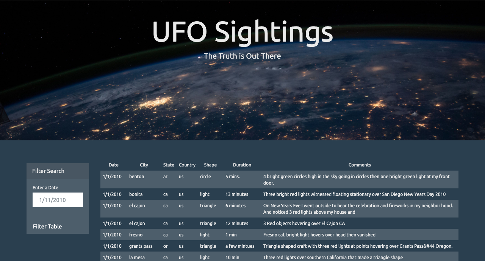

# UFO Encounters
Are aliens real? If so, have we already made contact with them? In any case, this application allows you to search through peoples' supposed encounters during January of 2010.

## Getting Started
### Installing
1) Git clone the repository to your local machine:
    ````
    https://github.com/markgat/UFO_Javascript.git
    ````
## Running
1) Simply go into the local repository, and open the "index.html" file within your local browser.
2) When the webpage loads, you can view a table of sightings within Canada and the United States from January 1, 2010 - January 13, 2010.
3) On the left of the table is a form to filter dates. Enter a single date as MM/DD/YYYY with no leadding zeros to see if any sightings were reported on a chosen date.
 